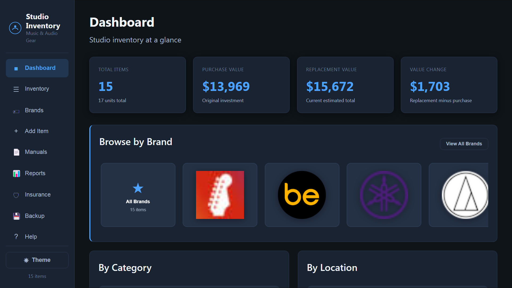
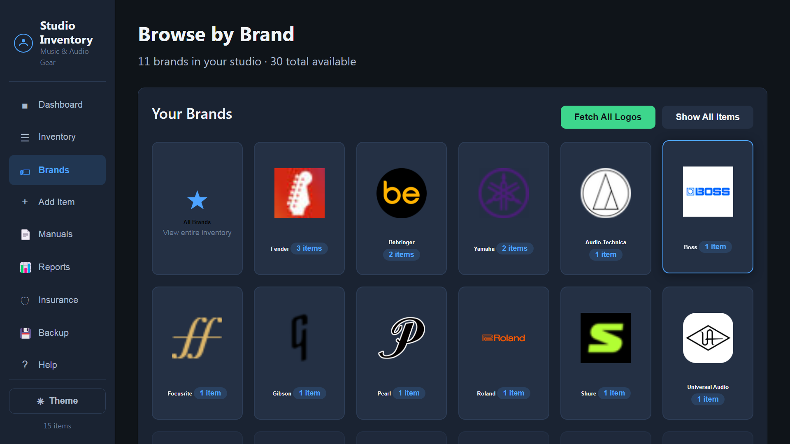

# Studio Inventory

**Local inventory management for physical musical instruments and audio hardware** — built for home studios, optimized for fullscreen use on large displays and local network access.

**Works on Windows, macOS, and Linux** — same app, same features. Your data stays on your machine.

[](https://github.com/TerkWerX/STUDIO-INVENTORY/actions/workflows/ci.yml)
[](LICENSE)
[](package.json)

> **Mac musician?** Start here → **[MAC.md](MAC.md)** — full setup guide (Node, Terminal, iPhone access, DYMO, troubleshooting).

> Tracks guitars, mics, interfaces, mixers, control surfaces, monitors, pedals, and amplifiers — **not** sample libraries, loops, or software sound assets.

<p align="center">
  
</p>

<p align="center">
  <em>Dashboard — totals, brand carousel, and studio breakdowns at a glance</em>
</p>

<p align="center">
  
</p>

<p align="center">
  <em>Brands page — tap any logo to filter your gear by manufacturer</em>
</p>

---

## Why Studio Inventory?

Home studios accumulate serious gear fast. Studio Inventory gives you one place to document what you own, what it's worth, where it lives, and the paperwork that matters for insurance and resale.

- **Touch-friendly dark UI** — large fonts and 56px+ tap targets for an 86" 4K TV
- **Runs entirely on your LAN** — no cloud account, no subscription
- **Insurance-ready exports** — PDF reports with photos and serial numbers
- **Brand browsing** — logo carousel and grid to filter gear by manufacturer

---

## Features

| Area | What you get |
|------|----------------|
| **Inventory** | Full CRUD with 15+ fields: serial, values, condition, location, tags, quantity |
| **Photos** | Multi-photo gallery per item with fullscreen lightbox |
| **Manuals** | PDF/document uploads with a global searchable list |
| **Software archive** | Paste manufacturer download URLs; server archives versioned drivers/firmware |
| **Driver updates** | One-click Google search for latest firmware (per-item toggle) |
| **Value estimates** | Opens targeted Reverb/eBay search; save replacement value in one step |
| **Search & filters** | Full-text search, category, location, condition, tags, value range, sorting |
| **Dashboard** | Totals, breakdowns, recent additions, high-value items, brand carousel |
| **Brands** | Auto-fetched logos, custom uploads, tap-to-filter item cards |
| **Owner Labels** | QR labels for DYMO LabelWriter — scan to open manuals, software, and item details |
| **Reports** | PDF, CSV, and JSON export |
| **Backup** | JSON + SQL dump + copy `data/uploads/` |
| **PWA** | Installable with offline shell caching |

---

## Download (Windows & Mac — no Node required)

Pre-built packages are on the **[Releases](https://github.com/TerkWerX/STUDIO-INVENTORY/releases)** page:

| Platform | Download | How to run |
|----------|----------|------------|
| **Windows** | `Studio-Inventory-v…-Windows.zip` | Extract → double-click **Start Studio Inventory.bat** (or **Install Studio Inventory.bat** for Desktop shortcut) |
| **macOS** | `Studio-Inventory-v…-macOS.zip` or `.dmg` | Extract / open DMG → double-click **Start Studio Inventory.command** (or **Install Studio Inventory.command** to copy to Applications) |

These bundles include Node dependencies — your friends do **not** need to install Node.js or run `npm install`.

---

## Quick Start (developers / git clone)

**Requirements:** [Node.js](https://nodejs.org/) 18+

```bash
git clone https://github.com/TerkWerX/STUDIO-INVENTORY.git
cd STUDIO-INVENTORY
npm install
npm run reseed    # optional: load 15 sample gear items (~$15k value)
npm start         # http://localhost:3847
```

Open **http://localhost:3847** — press **F11** (or **Cmd+Ctrl+F** on Mac) for fullscreen.

From another device on your network: `http://<your-computer-ip>:3847`

---

## Mac users

Studio Inventory runs natively on macOS — same features as Windows.

**→ [MAC.md — complete Mac setup guide](MAC.md)** (install Node, clone or ZIP download, iPhone scanning, DYMO labels, backups, troubleshooting)

Quick version:

```bash
git clone https://github.com/TerkWerX/STUDIO-INVENTORY.git
cd STUDIO-INVENTORY
npm install
npm start
```

Open **http://localhost:3847** · Use **⌘** for keyboard shortcuts · Skip `npm run reseed` unless you want demo sample gear.

---

## Project Structure

```
STUDIO-INVENTORY/
├── server.js              # Express API + static file serving
├── db.js                  # SQLite schema and helpers
├── seed.js                # Sample inventory data
├── lib/
│   ├── fetch-brand-logo.js
│   ├── brand-domains.js
│   └── brand-svg.js
├── public/                # Frontend (vanilla JS, dark theme)
│   ├── index.html
│   ├── css/styles.css
│   └── js/views/
├── scripts/
│   ├── fetch-logos.js
│   └── populate-logos.js
└── data/                  # Created at runtime (gitignored)
    ├── inventory.db
    └── uploads/
        ├── photos/
        ├── manuals/
        ├── software/
        └── logos/
```

---

## Data Storage

| Path | Contents |
|------|----------|
| `data/inventory.db` | SQLite database |
| `data/uploads/photos/{id}/` | Item photos |
| `data/uploads/manuals/{id}/` | PDFs and documents |
| `data/uploads/software/{id}/` | Archived drivers/firmware (all versions kept) |
| `data/uploads/logos/` | Brand logos (cached locally after fetch) |
| `data/backups/` | Recommended export destination |

Your database and uploads are **local only** and excluded from git. Back them up regularly.

### Full backup

1. **Backup** page → Export JSON + SQL dump
2. Copy the entire `data/uploads/` folder
3. Or copy the whole `data/` directory

---

## Owner Labels (QR + DYMO)

Print owner labels with QR codes for each piece of gear. Scanning with any phone opens a quick page with manuals, archived software, full details, and an edit link.

1. Install **DYMO Connect** and connect your LabelWriter 450 Turbo
2. Open **Owner Labels** in the sidebar
3. Set **QR Base URL** to your NUC's LAN IP (e.g. `http://192.168.1.50:3847`) so phones on Wi‑Fi can reach the server
4. Select items → **Print Selected (DYMO)** (30252 address labels recommended)
5. Affix labels to gear

**Browser fallback:** Use **Print Selected (Browser)** if DYMO Connect isn't detected — choose your label printer in the system print dialog (Windows or Mac).

From any item's detail page, click **Print Owner Label** for a one-off print.

## Brand Logos

Logos are fetched automatically when you add an item with a brand name.

1. Enter a **Brand** (e.g. `Fender`, `Shure`) when creating or editing an item
2. On save, the server fetches a logo from the web and caches it under `data/uploads/logos/`
3. Sources (in order): Clearbit → Unavatar → Google/DuckDuckGo favicons → generated SVG badge
4. On server start, missing logos are fetched for all brands in your inventory

Custom uploads via **Brands → Custom Brand Logo** are never overwritten.

```bash
npm run fetch-logos         # fetch missing logos only
npm run fetch-logos:force   # re-fetch all non-custom logos
```

Unknown brand? Add its domain to `lib/brand-domains.js`, or upload your own PNG.

---

## Software & Driver Archive

For interfaces, mixers, control surfaces, and keyboards:

1. Open item detail → **Software & Drivers Archive**
2. Paste a manufacturer download URL → **Download & Archive**
3. Or upload a local installer file directly
4. Use **Check for Updates** to search for newer drivers (manual, on-demand)

Disable update checks for end-of-life gear with the **Driver/Software Update Checks** toggle when editing an item.

---

## Auto-Start

### Windows

Double-click `start-studio-inventory.bat`, or add a shortcut to your Startup folder:

```
%APPDATA%\Microsoft\Windows\Start Menu\Programs\Startup
```

**Task Scheduler alternative:** trigger at startup, run `node.exe` with `server.js`, start in your project folder.

### macOS

```bash
chmod +x start-studio-inventory.sh
```

Then add `start-studio-inventory.sh` via **System Settings → General → Login Items**, or create a Launch Agent if you prefer it always running in the background.

---

## Keyboard Shortcuts

Works with **Ctrl** (Windows/Linux) or **⌘ Cmd** (Mac).

| Shortcut | Action |
|----------|--------|
| `Ctrl/⌘ + N` | New item |
| `Ctrl/⌘ + F` | Focus search (Inventory) |
| `Ctrl/⌘ + S` | Save item (form) |
| `Escape` | Close modal / lightbox |

---

## Scripts

| Command | Description |
|---------|-------------|
| `npm start` | Start server (port 3847) |
| `npm run seed` | Load sample data (skips if DB has items) |
| `npm run reseed` | Clear and reload sample data |
| `npm run fetch-logos` | Fetch missing brand logos |
| `npm run fetch-logos:force` | Re-fetch all non-custom logos |
| `npm run sync-brands` | Sync brand records from inventory items |
| `npm test` | Run CI smoke test (isolated temp database) |
| `npm run screenshots` | Capture README screenshots (server must be running) |

---

## Sample Data

`npm run reseed` loads 15 physical gear items — guitars, bass, mics, interfaces, control surface, mixer, monitors, piano, drums, amp, and pedals — with placeholder photos and ~$15,000+ total replacement value. Delete them when you're ready to enter your real studio.

---

## Tech Stack

- **Backend:** Node.js, Express, better-sqlite3
- **Frontend:** Vanilla JavaScript (ES modules), no build step
- **Storage:** SQLite + local filesystem uploads
- **PDF export:** jsPDF (CDN)

---

## License

[MIT](LICENSE) — Copyright (c) 2026 TerkWerX