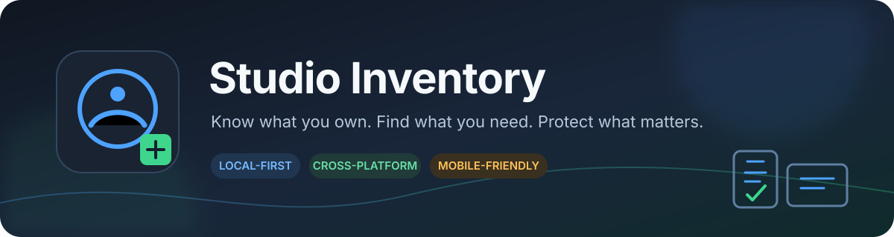
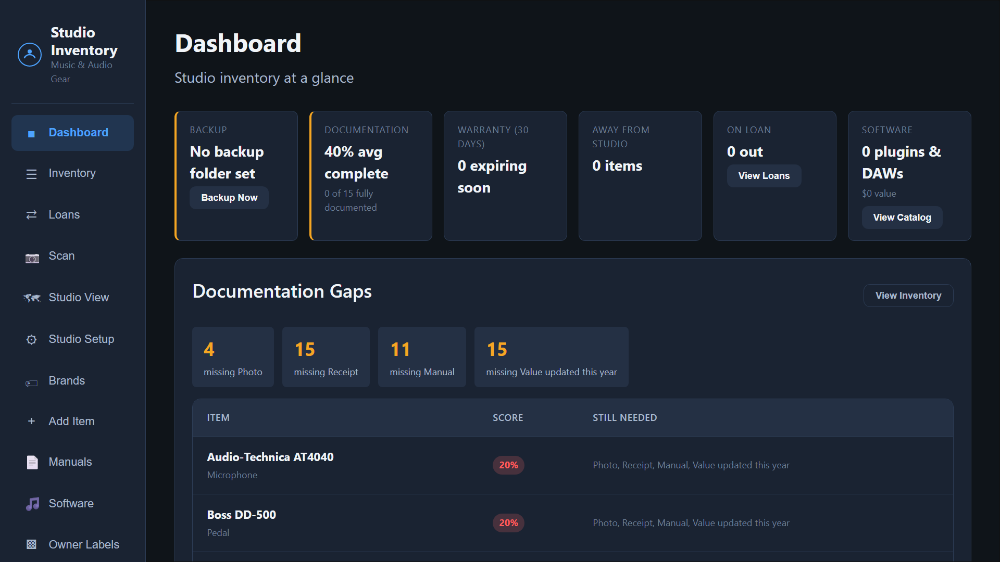
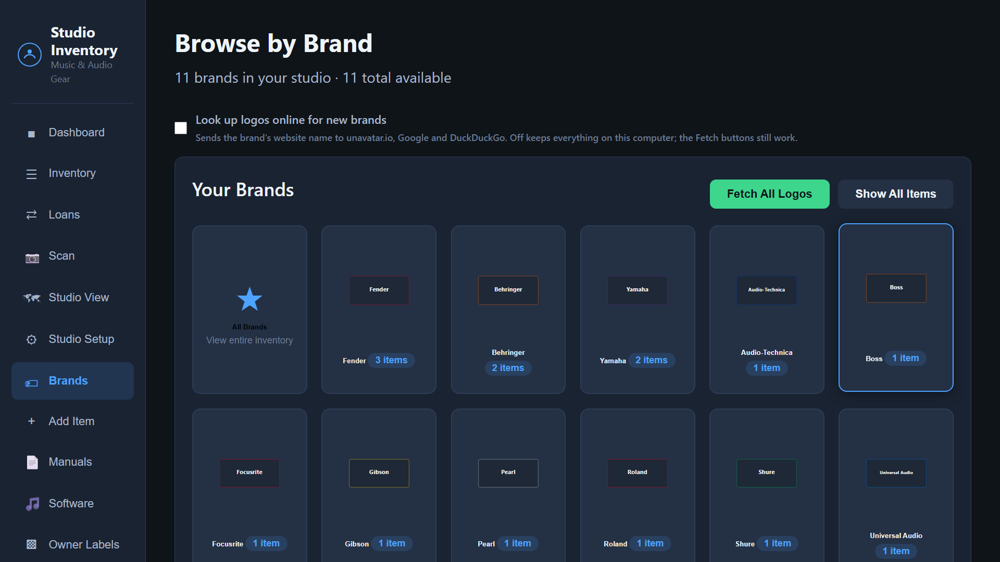

<p align="center">
  
</p>

<p align="center">
  <a href="https://github.com/TerkWerX/STUDIO-INVENTORY/releases/latest"></a>
  <a href="https://github.com/TerkWerX/STUDIO-INVENTORY/actions/workflows/ci.yml"></a>
  <a href="LICENSE"></a>
  
  
</p>

<p align="center">
  <strong>Know what you own. Find what you need. Protect what matters.</strong><br>
  A local-first inventory and studio-planning app for instruments, audio equipment, accessories, documents, and software.
</p>

<p align="center">
  <a href="https://github.com/TerkWerX/STUDIO-INVENTORY/releases/latest"><strong>Download</strong></a> ·
  <a href="https://github.com/TerkWerX/STUDIO-INVENTORY/wiki"><strong>Wiki</strong></a> ·
  <a href="https://github.com/TerkWerX/STUDIO-INVENTORY/discussions"><strong>Discussions</strong></a> ·
  <a href="https://github.com/TerkWerX/STUDIO-INVENTORY/issues"><strong>Issues</strong></a>
</p>

---

## Meet Studio Inventory

Gear collections grow one cable, bracket, instrument, and impulse purchase at a time. Studio Inventory gives musicians, engineers, rehearsal spaces, schools, collectors, and small studios one place to track the equipment itself—and the details that make it useful later.

- **No subscription or cloud account.** The database, photos, receipts, and manuals stay on the host computer.
- **Ready for real equipment chains.** Nest a drum pad under its mount, the adapter under that, and the paid thumb screws under the adapter.
- **Useful away from the desk.** Add photos and scan labels from Android Chrome/Edge or iPhone/iPad Safari on the same trusted network.
- **Built for proof of ownership.** Track serials, values, receipts, condition, warranties, manuals, and insurance notes.
- **Comfortable everywhere.** Responsive, touch-friendly layouts work on phones, tablets, desktops, and large displays.

## A quick look

<table>
  <tr>
    <td width="50%"></td>
    <td width="50%"></td>
  </tr>
  <tr>
    <td align="center"><sub><strong>Dashboard</strong> — value, documentation, loans, and recent activity</sub></td>
    <td align="center"><sub><strong>Browse by brand</strong> — a visual path through the collection</sub></td>
  </tr>
</table>

## What it can do

| Catalog and protect | Organize and connect | Plan and operate |
|---|---|---|
| Serials, values, condition, warranties, receipts, photos, and insurance reports | Smart profiles, nested components, compatibility history, tags, manuals, and searchable PDFs | Room layouts, calibrated wall views, rack and signal-chain planning, loans, and binder printing |
| Signed QR owner labels and read-only guest links | Cables, mounts, fasteners, patchbays, monitors, instruments, drums, and software licenses | Mobile photo capture, responsive PWA, brand browsing, documentation scoring, and backup/restore |

### Smart profiles understand the shape of the gear

Choose an **Item Type / Smart Profile** and the form reveals useful fields for that kind of equipment. Profiles cover brass and bowed strings, guitars and basses, acoustic and electronic drums, pads and cymbals, mounting hardware, fasteners, cables, patchbays, racks, and studio monitors.

```text
Electronic drum kit
└── Alesis ControlPad
    └── Gibraltar adapter clamp
        └── Mounting thumb screws
```

Every record can keep its own price, receipt, photos, specifications, and compatibility result. Parent records show the complete assembly value.

## Install

Pre-built releases include the runtime and production dependencies—no separate Node.js installation is required.

| Platform | Recommended download | Start here |
|---|---|---|
| **Windows** | `Windows-Setup.exe` | Run setup, then launch **Studio Inventory** |
| **macOS** | `.dmg` | Open the image and run the installer; if macOS blocks it, see [allowing it once](MAC.md#if-macos-blocks-it-the-first-time) |
| **Linux x64** | `.tar.gz` | Extract and run `Install Studio Inventory.sh` |
| **Portable use** | Platform ZIP | Extract and use the included launcher |

**[Download the latest release →](https://github.com/TerkWerX/STUDIO-INVENTORY/releases/latest)**

Existing inventory lives in the local `data/` folder and is preserved by release installers. Create a **Full Backup ZIP** before any upgrade.

Platform guides: **[macOS](MAC.md)** · **[Linux](LINUX.md)** · **[Wiki installation guide](https://github.com/TerkWerX/STUDIO-INVENTORY/wiki/Installation)**

## Phone and tablet access

1. Start Studio Inventory on the host computer.
2. Open **Backup & Restore** and set an owner PIN of at least six characters.
3. Connect the phone or tablet to the same trusted Wi-Fi network.
4. Open the LAN address shown by the app and enter the PIN.

Android Chrome/Edge and iPhone/iPad Safari support inventory editing and photo capture. Live barcode video requires HTTPS; the regular LAN address provides **Take a Label Photo** and signed QR links instead.

> [!IMPORTANT]
> Do not forward port `3847` to the internet. Normal LAN HTTP traffic is not encrypted. Use trusted WPA2/WPA3 Wi-Fi, HTTPS, or a VPN. Behind an HTTPS proxy with its own host name, add that name to `STUDIO_ALLOWED_HOSTS` (see [SECURITY.md](SECURITY.md)).

## Your data stays understandable

| Location | Contents |
|---|---|
| `data/inventory.db` | SQLite catalog |
| `data/uploads/` | Photos, receipts, manuals, logos, software, and studio images |
| `data/manual-inbox/` | Files waiting to be attached to an item |
| `data/backups/` | Suggested destination for backup exports |

The app supports Full Backup ZIP, JSON, SQL, CSV, and PDF exports. Full Backup ZIP is the complete recovery format because it includes managed files as well as the database.

## Run from source

Requires [Node.js](https://nodejs.org/) 22 or newer.

```bash
git clone https://github.com/TerkWerX/STUDIO-INVENTORY.git
cd STUDIO-INVENTORY
npm install
npm start
```

Open `http://localhost:3847`. To explore with sample equipment, run `npm run reseed` before starting.

```bash
npm test              # API, restore, security, and browser regression suite
npm run test:api      # server and API tests
npm run test:browser  # Playwright UI tests
```

### Technology

Node.js · Express · SQLite (`better-sqlite3`) · vanilla JavaScript modules · Playwright · local filesystem storage

There is no frontend build step. The server exposes the API and serves the responsive web app directly.

## Documentation and community

| Need | Go to |
|---|---|
| Learn the main workflows | [Project wiki](https://github.com/TerkWerX/STUDIO-INVENTORY/wiki) |
| Ask a question or share an idea | [Discussions](https://github.com/TerkWerX/STUDIO-INVENTORY/discussions) |
| Report a reproducible problem | [Issues](https://github.com/TerkWerX/STUDIO-INVENTORY/issues) |
| Help improve the project | [Contributing guide](CONTRIBUTING.md) |
| Report a security concern | [Security policy](SECURITY.md) |
| Get installation help | [Support guide](SUPPORT.md) |

Curious contributors are welcome. Documentation fixes, additional equipment profiles, accessibility improvements, browser testing, and thoughtful feature ideas are all useful.

## License

[MIT](LICENSE) © 2026 TerkWerX
